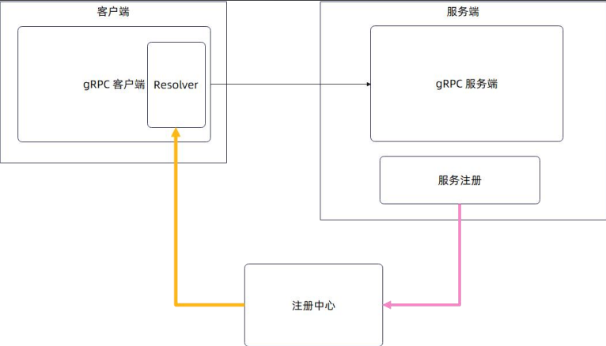

# emicro

#### 介绍
简单的微服务框架，该框架目前只用与学习

#### 软件架构
部分参考go-kratos、go-zero，但存在自定义的 rpc 协议

##### rpc协议的设计

**请求**

**请求头部：**

- 设计为不定长 
- 固定字段： 
  - 长度字段：用于分割消息 
  - 版本字段：描述协议版本，用于后续协议升级 
  - 序列化协议：用于标记采用的序列化协议 
  - 压缩算法：用于标记协议体是如何被压缩的 
  - 消息 ID：用于后续支持多路复用 
  - 服务名 
  - 方法名 
- 不固定字段：这部分主要是链路元数据。
- 请求数据

**响应**

**响应头部**： 

- 设计为不定长 

- 固定字段：
  - 长度字段：用于分割消息 版本
  - 字段：描述协议版本，用于后续协议升级 
  - 序列化协议：用于标记采用的序列化协议 
  - 压缩算法：用于标记协议体是如何被压缩的 
  - 消息 ID：用于后续支持多路复用 
  - 错误：为了解决第二个返回值的问题
- 响应数据

##### 服务注册与发现

